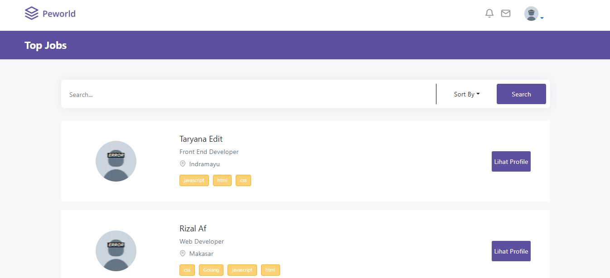
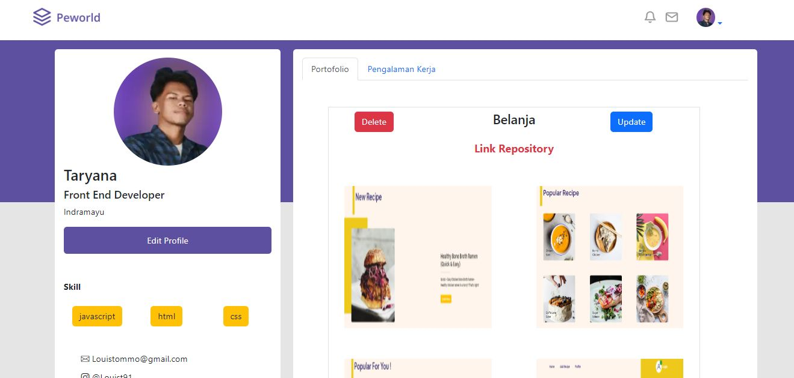

<div align="center">
  
</div>
<h3 align="center">Hire Jobs</h3>
<p align="center">
  <a href="https://fe-hire-jobs.vercel.app/">View Demo</a>
  ·
  <a href="https://github.com/nhana557/fe-hire-jobs/issues">Report Bug</a>
</p>

<!-- ABOUT THE PROJECT -->
## About The Project
Hire Jobs adalah sebuah aplikasi berbasis website yang memudahkan orang untuk mendapatkan pekerjaan atau perusahaan mencari dan mendapatkan karyawan. Hire Jobs dikembangkan dengan satck PERN (PostgreSQL, Express js, Nextjs, Node js). Hire jobs merupakan sebuah project individu, disini saya membuat Backend dan Frontend.


This is a [Next.js](https://nextjs.org/) project bootstrapped with [`create-next-app`](https://github.com/vercel/next.js/tree/canary/packages/create-next-app).

## Getting Started

First, run the development server:

```bash
npm run dev
# or
yarn dev
```

Open [http://localhost:3000](http://localhost:3000) with your browser to see the result.


### Technology Used
- [ReactJS](https://reactjs.org/)
- [Redux](https://redux.js.org/)
- [Bootstrap](https://getbootstrap.com/)
- [Axios](https://github.com/axios/axios)

<!-- GETTING STARTED -->
## Getting Started

### Installation
- Clone This Repository

`git clone https://github.com/nhana557/fe-hire-jobs.git`

- Install Module

`npm install`

- Setting .env

```bash
REACT_APP_API_BACKEND=YOUR_API_URL
```

### Executing program

- Run this project with `npm run start`.

<!-- SCREENSHOT -->
## Screenshot

### Login


### Detail 


### Profile


### Experience


<!-- RELATED PROJECT -->
## Related Project

- [Hire jobs BE](https://github.com/nhana557/Hire-Jobs-BE)
- [Hire jobs Demo](https://fe-hire-jobs.vercel.app/)

<!-- CONTACT INFO -->
## Contact Info

Contributors names and contact info:

1. Taryana

- [Linkedin](https://www.linkedin.com/in/taryana10/)


## Deploy on Vercel

The easiest way to deploy your Next.js app is to use the [Vercel Platform](https://vercel.com/new?utm_medium=default-template&filter=next.js&utm_source=create-next-app&utm_campaign=create-next-app-readme) from the creators of Next.js.

Check out our [Next.js deployment documentation](https://nextjs.org/docs/deployment) for more details.
